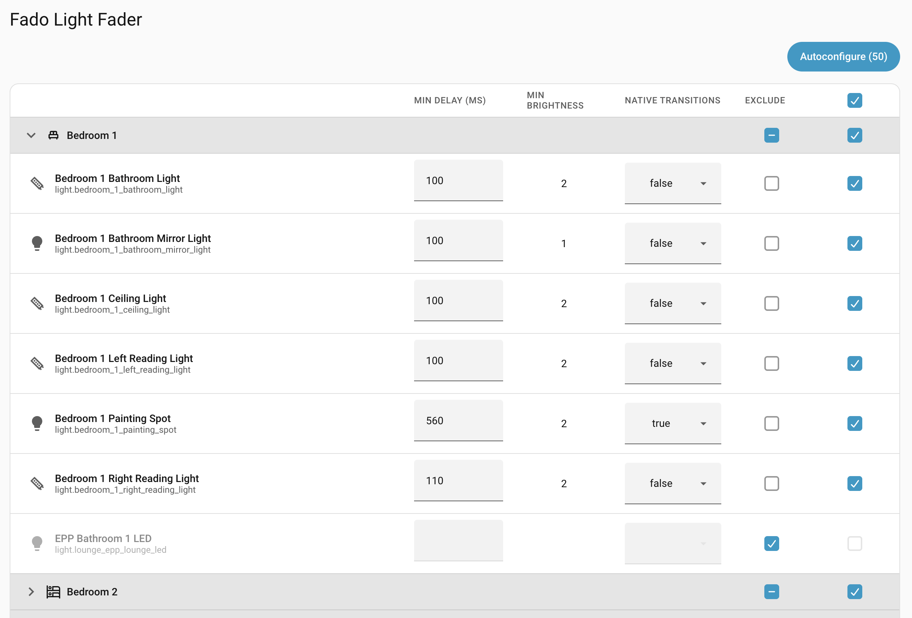

# Fado Light Fader

A Home Assistant custom integration, available in the HACS default store, that
provides smooth light fading for brightness, colors, and color temperatures,
with automatic brightness restoration, autoconfiguration via the UI, and
support for native transitions.

!!! tip "See it in action"

    **[▶ Try the interactive demo](https://clintongormley.github.io/ha-fado/)** —
    start a bedtime fade, interrupt it at the wall switch, and watch Fado
    restore the brightness you chose.

## Compatibility

- **Home Assistant:** 2025.2.0 or newer
- **Python:** 3.13 or newer

## Features

- Fade lights smoothly to any **brightness** level (0-100%) over a specified
    transition period, with **easing**
- Fade **colors** smoothly using HS, RGB, RGBW, RGBWW, XY, or **color
    temperature** (Kelvin)
- **Hybrid transitions** between color modes (e.g., color temperature to
    saturated color)
- Target lights by entity, device, area, floor, or label, or **light groups**
- Optionally specify **starting values** with the `from:` parameter for precise
    control
- Mostly drop-in replacement for the `light.turn_on` action
- Capability-aware: skips lights that don't support requested color modes
- Uses **native transitions** (where available) to smooth out each step for
    flicker-free fading
- Plays nicely with **manual adjustments** from the wall switch
- Setting brightness to 1% automatically sets the **minimum real brightness**
    supported by the light
- **Autoconfiguration UI** to determine optimal configuration for individual
    lights
- **Exclude/include** lights from fades and brightness restoration via actions
    or the configuration panel
- **Automatic restoration** of original (pre-fade) brightness when turning light
    on

## Next steps

- [Install Fado](installation.md)
- [Understand how it works](how-it-works/index.md)
- [The `fado.fade_lights` action reference](actions/fade-lights.md)
- [Set up the autoconfiguration panel](panel.md)
